# ZINX Meta Ariana - Full Stack Social Gaming Platform

A comprehensive social gaming and metaverse platform built with modern web technologies, featuring marketplace, clans, leaderboards, and integrated payment systems.

## 🚀 Tech Stack

### Frontend
- **Next.js** - React framework for production
- **React** - UI library
- **TypeScript** - Type-safe development
- **Tailwind CSS** - Utility-first styling

### Backend
- **Nest.js** - Progressive Node.js framework
- **PostgreSQL** - Relational database
- **TypeORM** - Database ORM
- **JWT** - Authentication

### Payment Integration
- **SSLCommerz** - Payment gateway integration

## ✨ Features

### User Management
- 🔐 Secure user authentication (Login/Signup)
- 👤 Comprehensive user profiles
- 🎮 Personalized dashboard
- 🏆 Achievement tracking

### Social Features
- 📱 Main feed for user interactions
- 👥 Clan/group management system
- 🏅 Real-time leaderboards
- 💬 Social engagement tools

### Marketplace
- 🛒 Full-featured marketplace
- 🛍️ Product browsing and discovery
- 💳 Secure checkout process
- 🔗 Purchase link generation
- 💰 Integrated payment processing

### Admin Panel
- 👨‍💼 Super admin dashboard
- 📊 Analytics and reporting
- 🎛️ Asset management
- 👥 User management
- 📈 System monitoring

## 📸 Screenshots

### Landing Page
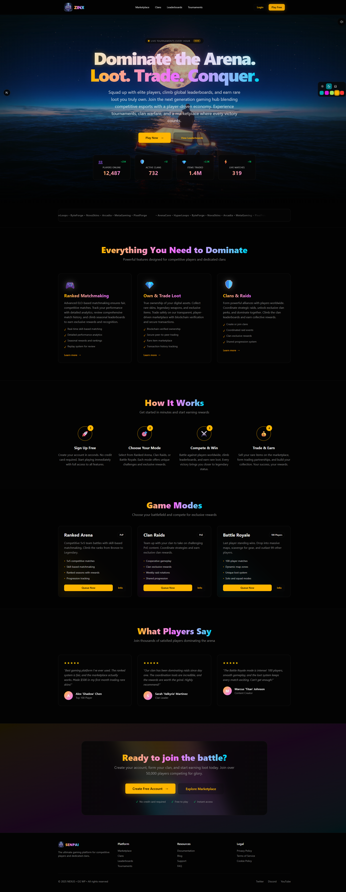

### Authentication
<table>
  <tr>
    <td>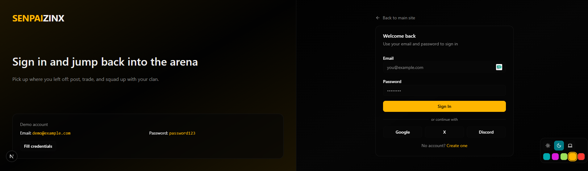</td>
    <td>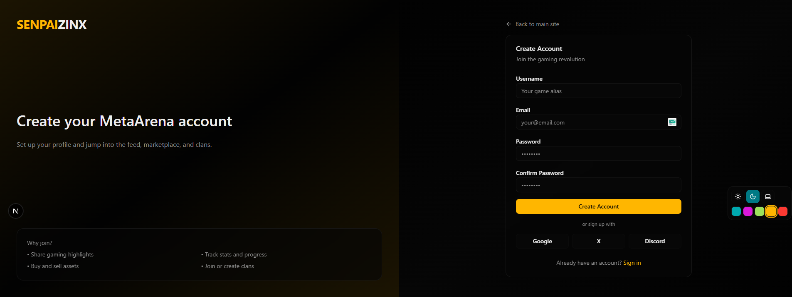</td>
  </tr>
</table>

### Main Features
| Dashboard | Profile |
|-----------|---------|
| 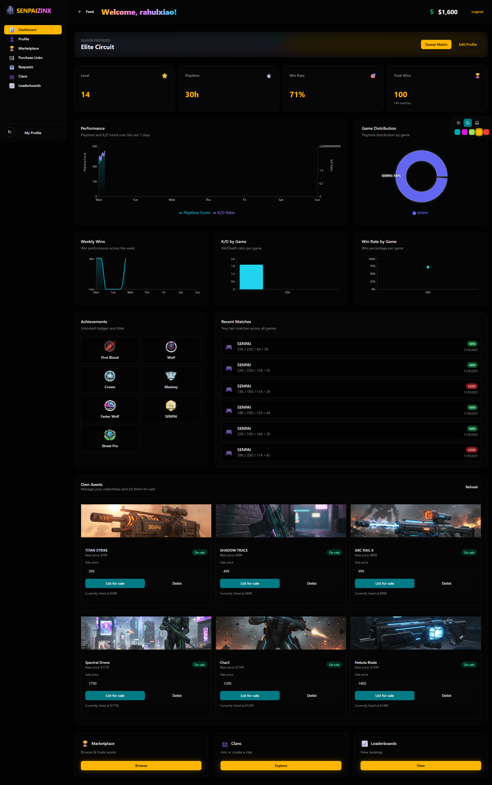 | 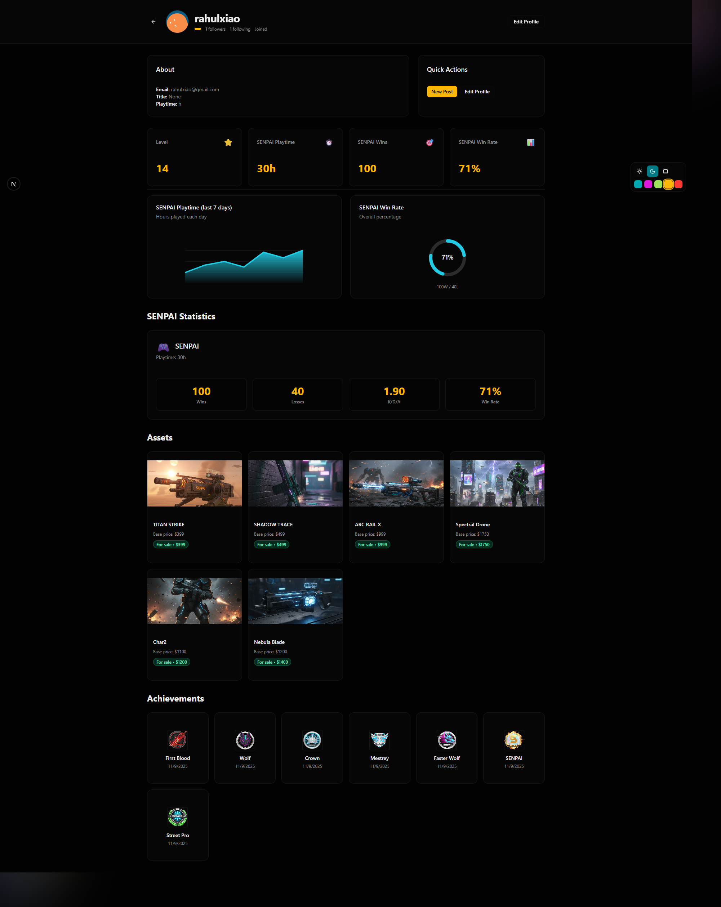 |

### Social & Gaming
<table>
  <tr>
    <td>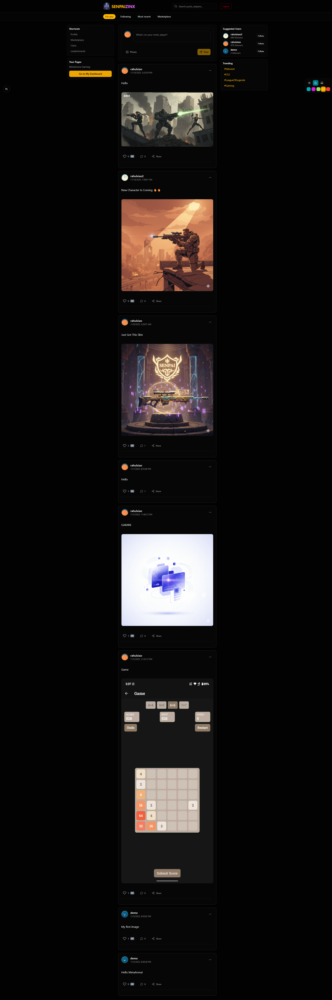</td>
    <td>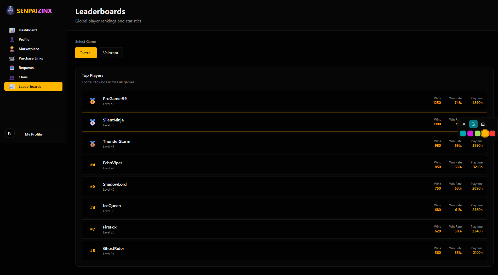</td>
  </tr>
  <tr>
    <td colspan="2">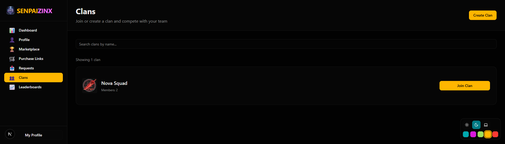</td>
  </tr>
</table>

### Marketplace
| Marketplace Feed | Marketplace |
|------------------|-------------|
| 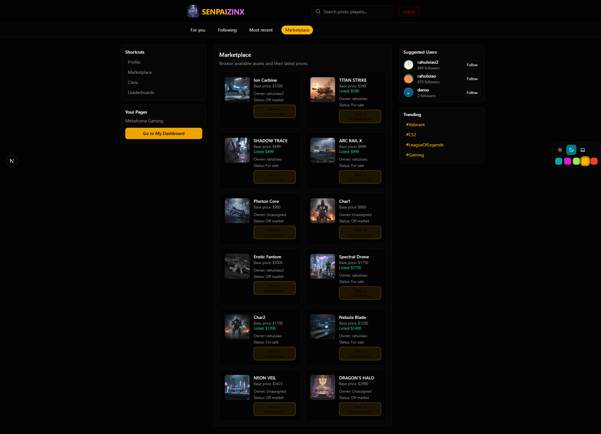 |  |

### E-Commerce
<table>
  <tr>
    <td>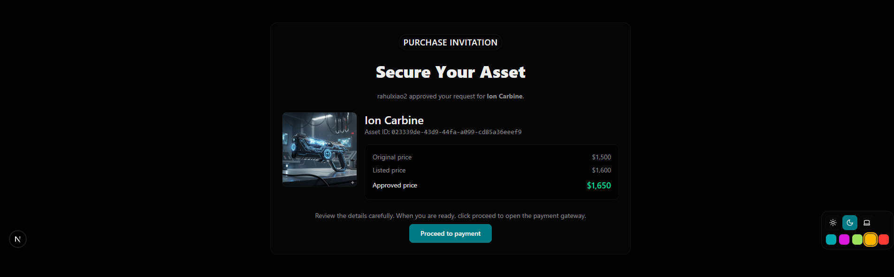</td>
    <td></td>
  </tr>
  <tr>
    <td colspan="2">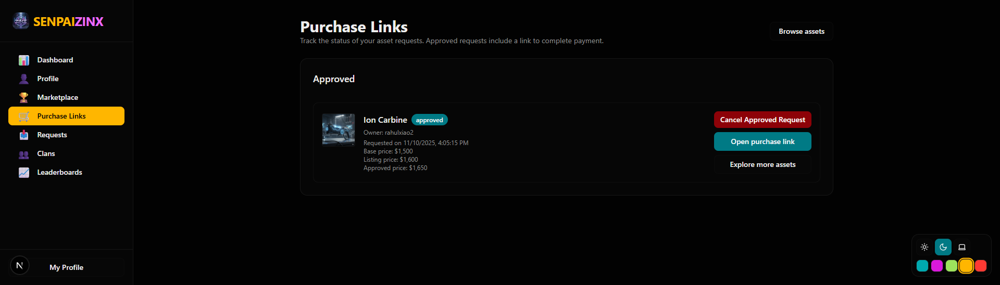</td>
  </tr>
</table>

### Admin Panel
| Super Admin | Asset Management |
|-------------|------------------|
| 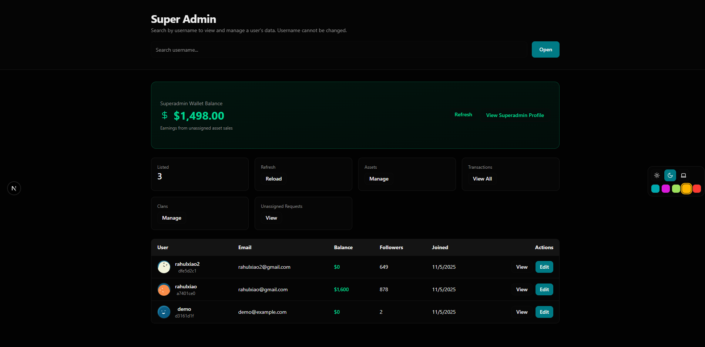 | 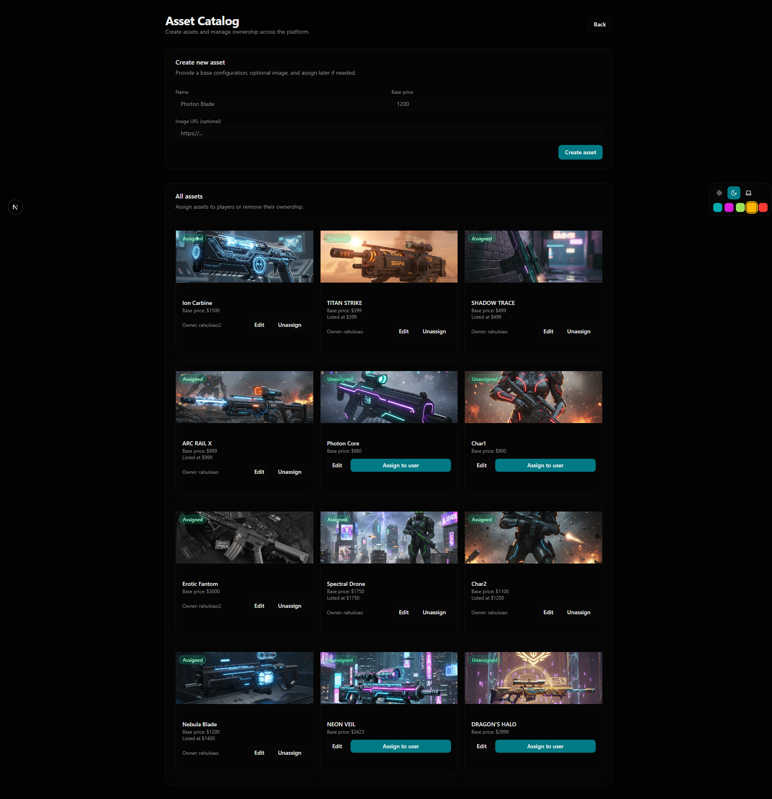 |

## 📝 License

This project is licensed under the MIT License - see the [LICENSE](LICENSE) file for details.

## 👥 Authors

-Rahul Biswas - *Initial work*
-Team SENPAI

## 🙏 Acknowledgments

- Next.js team for the amazing framework
- Nest.js team for the robust backend framework
- SSLCommerz for payment integration
- All contributors and supporters

## 📧 Contact

For questions or support, please reach out to:
- Email: rahulbiswaskpc@gmail.com@example.com
- Project Link: [https://github.com/rahulxiao/ZINX-Meta-Ariana-Full-Project](https://github.com/rahulxiao/ZINX-Meta-Ariana-Full-Project)

---

Made with ❤️ using Next.js, Nest.js & PostgreSQL